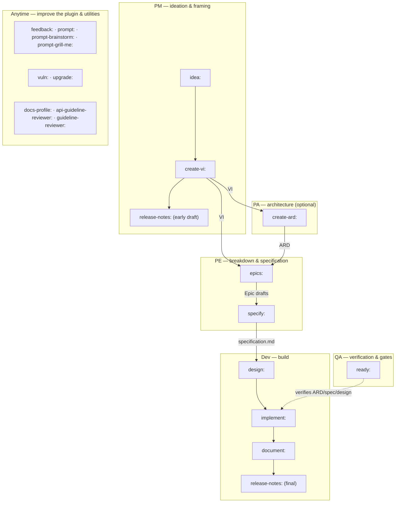
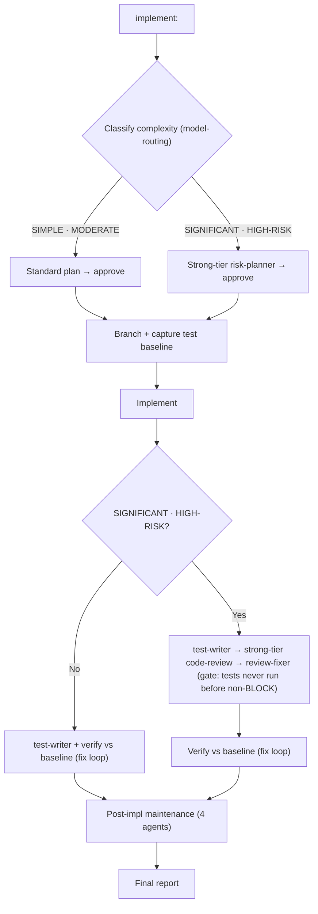

# dev-workflows

A GitHub Copilot CLI plugin providing a **full product-development lifecycle** as
structured workflow skills — from raw idea, through requirements and design, to
implementation, documentation, and release. Plus vulnerability remediation,
dependency upgrades, and guideline reviews.

## Installation

```
copilot plugin install dev-workflows@ihudak-copilot-plugins
```

## Triggers

Skills activate on a **flat keyword trigger** — the plugin runs when your prompt
*starts with* the keyword followed by a colon, e.g.:

```
implement: add rate limiting to the /login endpoint
document: PRODUCT-14902
vuln: CVE-2024-1234
```

## Skills

### Product-development lifecycle

The lifecycle skills chain from idea to release. Each writes a reviewable artifact
and offers the next phase.

| Trigger | Skill | Description |
|---------|-------|-------------|
| `idea:` | idea | Capture a raw idea and shape it into a structured problem statement. Pre-VI, keyless. |
| `create-vi:` | create-vi | Draft a Value Increment (VI) from an idea or problem statement (or seed a new one from a sibling VI with `--from-vi`). Reviewed by `vi-reviewer`. |
| `update-vi:` | update-vi | Refresh/re-do an existing Value Increment — Jira-import-first (source of truth), canonical + archived revisions. Reviewed by `vi-reviewer`. |
| `create-ard:` | create-ard | Draft an Architecture Decision Record for a VI. Reviewed by `ard-reviewer`; resolves open decisions. |
| `specify:` | specify | Write an engineering specification (Jira-driven). Reviewed by `spec-reviewer`. |
| `design:` | design | Write an engineering design from a specification. Reviewed by `design-reviewer`. |
| `epics:` | epics | Draft child Epic definitions for a VI (Jira-driven). Scans repos via `code-scanner`; reviewed by `epic-reviewer` (Opus). |
| `implement:` | implement | Implement a feature or fix. Classifies complexity → risk-weighted plan (Opus critique for complex tasks) → branch → test baseline → implement → `test-writer` → Opus code-review (SIGNIFICANT/HIGH-RISK) → verify no regressions → post-impl maintenance. |
| `document:` | document | Dual-mode documentation. **Doc-edit mode** for direct Markdown/wiki/vault edits; **Jira mode** reads Jira exports + merged PRs, runs parallel `diff-summarizer`s, plans via `doc-planner`/`doc-location-finder`, writes with mandatory citations, style-checks, and gates on `doc-reviewer`. On a space-constrained run, `--counterpart <JiraID|PR-url>` (or auto-discovery) grounds the doc on the other space's existing docs — read-only, never copied, never an image source. |
| `release-notes:` | release-notes | Generate release notes for a VI in dynatrace-docs block format. Output to markdown/stdout — **never** written into the docs repo (Jira automation owns that path). |
| `ready:` | ready | Readiness gate: verify a VI/feature is ready to ship. Reviewed by `readiness-reviewer`. |

### Maintenance & review workflows

| Trigger | Skill | Description |
|---------|-------|-------------|
| `vuln:` | vuln | Remediate one or more CVEs. Researches each via NVD (`vuln-research`), applies the minimal safe version bump (`vuln-fixer`), verifies tests, applies Opus code-review, runs post-batch maintenance. One branch + PR per CVE. |
| `upgrade:` | upgrade | Upgrade dependencies to a target version. Branch → test baseline → per-component compatibility plan (`upgrade-planner`) → upgrade + verify in sequence (`upgrade-executor`) → Opus code-review → maintenance. |
| `api-guideline-reviewer:` | api-guideline-reviewer | Review OpenAPI specs against Dynatrace REST API and IAM permission naming guidelines. Thin dispatcher → `api-guideline-reviewer` agent. |
| `guideline-reviewer:` | guideline-reviewer | Review code/UI against Dynatrace Experience Standards (GUIDElines) — component usage, accessibility/WCAG, terminology. Thin dispatcher → `guideline-reviewer` agent. |
| `docs-profile:` | docs-profile | Bootstrap or refresh a machine-readable `.dev-workflows/docs-profile.yml` for a docs repo (consumed by `document:` Jira mode). Writes as a reviewable PR. |

### Utilities

| Trigger | Skill | Description |
|---------|-------|-------------|
| `feedback:` | feedback | Capture structured feedback about a plugin run into the specs repo. |
| `prompt:` | prompt | Improve or refine a prompt. |
| `prompt-brainstorm:` | prompt-brainstorm | Collaboratively brainstorm and expand a prompt/idea. |
| `prompt-grill-me:` | prompt-grill-me | Adversarially interrogate a prompt/plan to surface gaps. |

**Which docs skill?** `document:` doc-edit mode is for one-shot manual doc edits (no Jira, no branch/commit). `document:` Jira mode is the Jira-driven feature-documentation workflow end to end. `docs-profile:` is a one-time profiler that generates a repo's `.dev-workflows/docs-profile.yml` (consumed by `document:` Jira mode).

**Counterpart-space grounding (`document: <VI> saas|managed`).** When you document one space, someone may already have written the *other* space's docs for the same feature. `document:` discovers that counterpart page (in-tree keyword search + `git log --grep`, or an explicit `--counterpart <JiraID|PR-url>` for an unmerged PR) and hands it to the writer as **read-only grounding** — concepts, terminology, and structure to consult, never text to copy and never screenshots to reuse (Managed and SaaS UIs differ; target images still come from `$VAULT_PATH`). If the counterpart page is already pulled into your target's render, the run tells you the space may already be covered.

## Workflow overview

The lifecycle skills form a role-based pipeline. Each role has a starting trigger and hands a concrete artifact to the next role. `idea: → create-vi:` (PM) opens it; `document:` + `release-notes:` (Dev) close it.



| Role | Starts with | Consumes | Produces → where it lands |
|------|-------------|----------|---------------------------|
| **PM** | `idea:`, `create-vi: <KEY>`, `update-vi: <KEY>`, `release-notes: <VI>` | a prompt / community post / RFE; then a refined `idea.md` + a JIRA-KEY | `<KEY>_<slug>.md` in `$SPECS_PATH/specifications/<KEY>-<slug>/` (idea.md relocated in); an early release-notes draft in the vault; paste-to-Jira → re-import to `$VAULT_PATH/jira-products/<KEY>/` |
| **PA** *(optional)* | `create-ard: <VI> [<Epic>]` | the VI (and Epic) | `<VI>_ARD.md` / `<EPIC>-<area>_ARD.md` in the same specs feature folder |
| **PE** | `epics: <VI>`, `specify: <VI> [<Epic>]` | the VI (+ ARD, existing Epics) | Epic drafts in `$VAULT_PATH/jira-drafts/<VI-KEY>/`; `specification.md` on the specs-repo main (branch + PR) |
| **Dev** | `design: <VI> <Epic>`, `implement: <VI> <Epic>`, `document: <VI>`, `release-notes: <VI>` | the `specification.md` (+ ARD); `design.md`; the code repos | `design.md` on the specs-repo main; code + PR in `$REPOS_PATH`; product docs in the docs repo; the final release-notes draft in the vault |
| **QA** | `ready: <VI \| Epic>` (+ the strong-tier reviewer gate embedded in every authoring/build skill) | the Jira status + the ARD / spec / design artifacts | a `SUPPORTED` / `PARTIAL` / `NOT-SUPPORTED` verdict — read-only; sets no status |

**`specify:` VI-level scope.** `specify: <VI>` (no focus Epic) is valid and stays in the PE lane — the `[<Epic>]` above is genuinely optional, it's just collapsed at this diagram's role-level granularity. For a VI with **≥2 Epics**, Phase 2 renders the Epic picker and offers three paths: pick one Epic (the usual per-Epic spec), explicitly **"Author one broad VI-level spec instead,"** or the tool's own recommendation, **"Split into Epics first with `epics:`, then re-import."** For a **single-Epic VI**, `specify: <VI>` auto-resolves to that Epic — there is no true VI-level path in that case. A broad VI-level spec writes one `specification.md` for the whole VI (branch `spec/<VI>-<vslug>` instead of `spec/<EPIC>-<eslug>`), and its `### Next step` recommendation points to `epics: <VI>` (still PE) rather than `design: <VI> <Epic>` (Dev).

**Sources of truth & artifact homes**

- **Jira** is the source of truth for workflow *status*. The external `jira-workitem-import` tool imports the ticket tree into `$VAULT_PATH/jira-products/<KEY>/`; the plugin reads status but **never sets it**.
- **`$SPECS_PATH/specifications/<KEY>-<slug>/`** — the shared, team-visible home for the VI, ARD, `specification.md`, and `design.md`.
- **`$VAULT_PATH`** — your personal store: `Projects/<area>/<slug>/idea.md`, the imported `jira-products/` tree, `jira-drafts/<VI-KEY>/` Epic drafts, and release-notes drafts.
- **`$REPOS_PATH`** — the code clones (`implement:` works on branches + PRs here); product documentation is written into the external **docs repo**.
- **Plugin-generated artifacts live in the specs repo.** Feedback and follow-up files are written under `<VI-dir>/dev-workflows/` in `$SPECS_PATH` — `<KEY>-feedback.md` and `<KEY>-followups.md`. **Committing and pushing these alongside the specs is expected and encouraged** — team-visible feedback is the point, not clutter. (Unlike the Claude Code edition, there is no `cost/<sid8>.md` — see [Not ported](#not-ported-from-the-claude-code-edition).)

**Cross-cutting skills (any time)**

- **Plugin improvement — please use these.** `feedback:` logs a note about the plugin itself; `prompt:`, `prompt-brainstorm:`, and `prompt-grill-me:` turn a correction you just made into logged feedback plus a fix.
- **Standalone maintenance.** `vuln:` (CVE remediation) and `upgrade:` (dependency / runtime upgrades) run on their own, outside the VI pipeline.
- **Repo tooling.** `docs-profile:` (bootstrap a docs repo's profile), `api-guideline-reviewer:` and `guideline-reviewer:` (Dynatrace API / UI compliance reviews).

*Legend: **Dev** is the plugin's "Team" lane; **QA** denotes verification and quality gates, not an artifact-authoring role; `release-notes:` appears twice because it serves a PM early draft (from the VI alone) and a Dev final draft (grounded in the merged PR diffs).*

## `implement:` workflow



`document:` (both modes) and `epics:` never run tests and never touch production code.

## Session feedback

Beyond the lifecycle skills, `dev-workflows` captures **friction and improvement
signals about the plugin itself** and persists them per-VI into the specs repo,
so the plugin maintainer can aggregate feedback across engineers and plan
improvements. Capture is **silent and high-recall** — there is no approval gate;
curation is the maintainer's job, centrally, at analysis time.

- **Automatic.** The end-of-run maintenance phase of the lifecycle and maintenance
  skills (`implement:`, `document:`, `epics:`, `vuln:`, `upgrade:`, `release-notes:`,
  `specify:`, `design:`, `idea:`, `create-vi:`, `create-ard:`, `ready:`) projects the
  plugin-facing slice of the `impl-maintenance` report (workflow improvements, new
  agents/skills, reference-doc gaps) into a feedback entry (`origin: auto`). A
  routine session with no plugin-facing signal writes nothing.
- **`feedback: <text>`** — a universal manual note about the plugin, tied to no
  skill (`origin: manual`).
- **`prompt: <text>`** — capture a corrective interaction (a skill produced
  something wrong; you fix it) as Friction + your verbatim prompt + the
  Resolution, then act on the correction directly (`origin: prompt`).
- **`prompt-brainstorm: <text>`** — same capture, then hand off to a
  collaborative brainstorm.
- **`prompt-grill-me: <text>`** — same capture, then grill the fix **inline** — a
  bounded one-question-at-a-time interrogation of the correction.

**Graceful degradation.** Persistence is **specs-first** (central aggregation is
the point) and deterministic: `$SPECS_PATH` VI dir
(`<VI-dir>/dev-workflows/<KEY>-feedback.md`) → `$SPECS_PATH/dev-workflows-feedback/`
→ a writable vault (with a loud "won't auto-aggregate to the maintainer" notice)
→ beside an imported Jira directory → report-only. It **never** writes into the
current working directory, and no capture phase ever fails the run. See
[`skills/_shared/feedback-emission.md`](skills/_shared/feedback-emission.md).

## Sub-agents

Each sub-agent lives in `agents/<name>.md` and is dispatched with
`task(agent_type: "dev-workflows:<name>", ...)`. Agents run in their own context
window and inherit the orchestrator's model **unless the caller passes an explicit
`model:` override on the `task()` call** — there is no `model:` frontmatter pin on
the agent file itself (unlike the Claude Code edition, where the nine strong-tier
reviewers/planners are pinned in frontmatter). The caller is responsible for
passing the strong-tier model for the nine reviewer/planner agents below. There
are **31** sub-agents:

| Agent | Model | Description |
|-------|-------|--------------|
| `risk-planner` | Strong tier, caller-pinned | Risk-weighted planner for SIGNIFICANT / HIGH-RISK tasks. Returns a structured plan with an explicit risks section. Refuses SIMPLE / MODERATE and returns a re-classification notice instead. |
| `code-review` | Strong tier, caller-pinned | Post-implementation reviewer — 8 dimensions (correctness, security, architecture, edge cases, migration, dependencies, test adequacy, rollback). Verdict: PASS / PASS WITH RECOMMENDATIONS / BLOCK. BLOCK gates the test run. |
| `doc-reviewer` | Strong tier, caller-pinned | Product-documentation reviewer for `document:` — checks factual correctness, completeness vs plan, audience fit, structural integrity, frontmatter, screenshots, snippets, actionability, source traceability, cross-space grounding integrity, and style-check follow-through. |
| `epic-reviewer` | Strong tier, caller-pinned | Epic-draft reviewer for `epics:` — goal clarity, testable acceptance criteria, scope boundaries, dependencies, non-duplication vs sibling Epics (BLOCKER), and reference-path evidence (when `code-scanner` output is provided). |
| `spec-reviewer` | Strong tier, caller-pinned | Specification reviewer for `specify:` — checks problem/scope clarity, user-story and acceptance-criteria testability, test-case coverage, open-question resolution (BLOCKER on unresolved items that could be resolved live), and adherence to the org-standard `specification.md` format. |
| `design-reviewer` | Strong tier, caller-pinned | Engineering-design reviewer for `design:` — validates `design.md` against the design-format authority and traceability to its `specification.md` (every in-scope requirement covered; BLOCKER on a gap), plus interface concreteness, seam/test-strategy soundness, and risk coverage. Treats any unresolved `design.md` open question as a BLOCKER. |
| `vi-reviewer` | Strong tier, caller-pinned | Value-Increment reviewer for `create-vi:` — validates the VI against `vi-format.md`: mandatory-spine completeness, testable acceptance criteria, scope/success-metric clarity, and hollow-prose / filler (MAJOR). |
| `ard-reviewer` | Strong tier, caller-pinned | Architecture-decision-record reviewer for `create-ard:` — checks each `AD-N` has a concrete Binds/Prevents/Rule, grounding findings cite real `file:line`, the cross-repo map is coherent, and open questions are surfaced. |
| `readiness-reviewer` | Strong tier, caller-pinned | Readiness reviewer for `ready:` — verifies the Jira status against the actual ARD/spec/design artifacts and returns a SUPPORTED / PARTIAL / NOT-SUPPORTED readiness verdict. Read-only; never sets Jira status. |
| `test-baseliner` | Caller-assigned | Runs the test suite in `capture` or `verify` mode; `verify` diffs against a prior baseline and returns a structured regression report. Framework detection: Maven, Gradle, npm, pytest, Makefile. |
| `test-writer` | Caller-assigned | Writes tests for new or changed behaviour based on a diff. Never runs tests. Framework detection mirrors `test-baseliner`; returns "not detected" immediately if no framework is configured. |
| `review-fixer` | Caller-assigned (default, not strong tier) | Applies BLOCKER / MAJOR findings from a `code-review` report; returns a structured fix report. Used by `implement:`, `vuln:`, `upgrade:`. |
| `upgrade-planner` | Caller-assigned | Phase-1 compatibility planner for `upgrade:`: detects the component, resolves the target version (exact/minor/latest/lts/bare), and verifies compatibility with other components. Returns a structured upgrade plan or a conflict report. |
| `upgrade-executor` | Caller-assigned | Phase-2 executor for `upgrade:`: applies the plan for one component, runs the build, verifies tests via `test-baseliner`, and auto-fixes test-code breakage from the new version's API changes. |
| `vuln-research` | Caller-assigned | Read-only research phase of `vuln:`: NVD lookup, library detection, current-version discovery, and minimum-safe-version resolution. No side effects. |
| `vuln-fixer` | Caller-assigned | Fix phase of `vuln:`: captures a baseline, applies the minimal version bump, rebuilds, verifies tests, commits to a branch, and opens a PR. |
| `doc-fixer` | Caller-assigned | Applies BLOCKER / MAJOR findings from a `doc-reviewer`, `epic-reviewer`, or `docs-style-checker` report. Shared between `document:` and `epics:`. |
| `docs-style-checker` | Caller-assigned | Runs the docs repo's project-configured prose linter (Vale, `package.json` lint script, markdownlint, or remark) on files written by `document:`, and falls back to `dt-style-checker` when no repo linter exists. |
| `doc-planner` | Caller-assigned | Synthesises Jira data + per-repo diff summaries + confirmed write targets into a documentation checklist the writer follows and `doc-reviewer` checks against. Detects the repo's image policy (local / CDN-upload / ambiguous). |
| `doc-location-finder` | Caller-assigned | Finds the write target(s) in a docs repo — extend-existing, new-page-in-existing-section, or new-section — with confidence scoring. Never writes content. |
| `doc-writer` | Caller-assigned | Writes product documentation for `document:` from a structured handoff file — applies the `doc-planner` checklist, approved per-page write strategies, discrepancy decisions, snippets, screenshots, frontmatter, and internal links. Write-only; never runs git. |
| `counterpart-finder` | Caller-assigned | For a space-constrained `document:` run, finds the OTHER space's existing docs for the feature (in-tree keyword search + `git log --grep`, or an explicit `--counterpart` Jira/PR ref via the diff-summarizer resolver) and returns read-only grounding. Never writes; never an image source. |
| `jira-reader` | Caller-assigned | Reads the pre-exported Jira markdown hierarchy (VI, Epics, Stories, Sub-tasks, Research, RFA) from `$VAULT_PATH/jira-products/<KEY>/`. Parses PR URLs and classifies hosts. Read-only. Used by `document:`, `epics:`, `release-notes:`, and `implement:` (multi-source input). |
| `idea-reader` | Caller-assigned | Read-only ingester for `idea:` — auto-detects the source type (inline prompt, markdown file with followed wikilinks/images, community post, or exported RFE Jira ticket) and returns a provenance-tagged normalization. Never writes files. |
| `release-notes-writer` | Caller-assigned | Renders the dynatrace-docs authored release-notes body for a Jira VI or ticket: a `{{#context}}` label, `### title`, and customer-facing prose. Emits no Jira IDs, no PR links, and no `{{#internal-note}}` block. Does not write files; returns the draft to the caller. |
| `diff-summarizer` | Caller-assigned | Resolves a single repo's PR diffs and returns a doc-focused summary. GitHub uses the `gh` CLI when available; Bitbucket Cloud / Server + GitHub-fallback use local-git strategies. Designed for parallel invocation (caller caps at 4 concurrent). |
| `code-scanner` | Caller-assigned | Scans one repo for existing capabilities and gaps relative to themes (from an Epic or an implementation spec). Fanned out one-per-repo, cap 4 concurrent. Used by `epics:` and `implement:` (multi-source fan-out). |
| `epic-writer` | Caller-assigned | Writes child Epic-definition files for `epics:` from a structured handoff file — one file per Epic, following the Epic template, traceable to the `jira-reader` handoff and `code-scanner` evidence. Write-only (vault content); never commits. |
| `impl-maintenance` | Caller-assigned | Post-session lessons-learned analyst. Reads the session handoff, scans `copilot-instructions.md` rules / hooks / reference docs / agents, and returns a structured Lessons Learned report. Suggest-only; does NOT write files. |
| `guideline-reviewer` | Caller-assigned | Reviews Dynatrace app code and UI for compliance with Dynatrace Experience Standards (GUIDElines). Checks AppHeader, DataTable, FilterField, Connections, Permissions, Settings, Dashboards, accessibility/WCAG, terminology, and Grail naming. |
| `api-guideline-reviewer` | Caller-assigned | Reviews OpenAPI specification files against Dynatrace REST API and IAM permission naming guidelines. Checks version consistency, required elements, naming conventions, IAM scope format, HTTP status codes, and schema composition. |

"Caller-assigned" = no fixed pin; tier is assigned by the invoking skill per the `model-routing` policy (mechanical → default session model, synthesis/review → strong tier).

## Model routing

`skills/_shared/model-routing.md` is the single source of truth for complexity
classification, the model fallback chain, and the 8-dimension Opus code-review
checklist. All orchestrators load it at runtime; sub-agents receive the routing
block in their prompt.

| Complexity | Model |
|------------|-------|
| SIMPLE | Default session model |
| MODERATE | Default session model (with structured planning) |
| SIGNIFICANT / HIGH-RISK | Strong tier — `claude-opus-4.8` / `4.7` / `4.6` or `gpt-5.5`, pinned via `model:` override |

The strong tier treats Opus 4.8/4.7/4.6 and GPT-5.5 as peers (fallback chain:
Opus 4.8 → 4.7 → 4.6 → Haiku 4.5 → GPT-5.5 → Sonnet 4.6 → Sonnet 4.5 → GPT-5.4 →
Gemini 3.1 Pro).

## Feature highlights

- **Full lifecycle**: `idea:` → `create-vi:` → `create-ard:` → `specify:` →
  `design:` → `epics:` → `implement:` → `document:` → `release-notes:` → `ready:`,
  each with a dedicated Opus/GPT-5.5 reviewer sub-agent.
- **Source-code is the truth, discrepancies escalate to YOU**
  (`_shared/source-truth.md`): every sub-agent that writes or reviews user-visible
  docs verifies enums, labels, defaults, and counts against the actual source.
  When source and Jira disagree, the plugin presents an analysis table and asks
  you per-discrepancy — it never silently picks a winner.
- **Mandatory style checking with fallback**: docs workflows run a style-check
  phase that cannot be skipped. If the repo's linter (Vale, markdownlint, remark)
  is unavailable, `docs-style-checker` falls back to `dt-style-checker` from the
  `dt-style-guide` plugin. Some check is always better than no check.
- **Branch-per-change** with shared **branch-prefix detection**
  (`_shared/branch-naming.md`): resolves the prefix via `$GIT_USER_INITIALS` →
  `git config user.initials` → existing-branch sniff → workflow fallback. Teams
  with `<initials>/`-prefix conventions set the env var once and every workflow
  follows it.
- **Jira-driven docs & epics**: `document:` (Jira mode) and `epics:` read Obsidian
  vault Jira exports, resolve PR URLs as **pure local-git identifiers** (no
  Bitbucket REST API, no HTTPS fetch), run parallel `diff-summarizer`s or
  `code-scanner`s per repo, and produce output with mandatory inline Jira + PR
  citations.
- **Repo discovery via `$REPOS_PATH`**: Jira workflows resolve repo URL slugs to
  local clone paths by scanning `$REPOS_PATH` (default `/workspace`; colon-separated
  list supported) and matching `git remote get-url origin`. When multiple clones
  share an upstream, the fast copy (`<slug>-repo`) is auto-preferred.
- **Release-notes draft**: `release-notes:` renders dynatrace-docs block format
  and writes to markdown or stdout — **never** into the docs repo (Jira automation
  owns that path); you paste the draft into Jira and automation re-emits it.
  Staged artifacts are **never** written to `/tmp/` (container restarts wipe it).
- **Test-writing gate**: `implement:` writes tests for all new/changed behaviour
  via `test-writer` and verifies no regressions against a pre-impl baseline. No
  test framework? The workflow asks — it never silently skips.
- **Opus/GPT-5.5 code-review gate**: code workflows run a strong-tier review before
  committing for SIGNIFICANT/HIGH-RISK tasks; `review-fixer` auto-applies fixable
  findings.
- **Post-batch maintenance**: `impl-maintenance` updates the knowledge base,
  `copilot-instructions.md`, and project docs after each workflow.
- **Stateless sub-agents**: every sub-agent receives full context in its prompt —
  no hidden state between calls.

## Not ported from the Claude Code edition

Two features from the upstream Claude Code plugin are intentionally omitted because
they depend on capabilities GitHub Copilot CLI does not expose:

- **Session cost reporting** (`/statusline`, `emit-cost`) — no cost/usage API.
- **Statusline integration** — no statusline extension point.

## Hooks

| Hook | Trigger | Description |
|------|---------|-------------|
| `notify-done` | Stop | Desktop notification when a workflow completes. |
| `preload-context` | UserPromptSubmit | Injects git/context info on lifecycle-skill triggers (`implement:`, `document:`, `epics:`, `release-notes:`, `vuln:`, `upgrade:`, …). |
| `test-notify` | PostToolUse | Parses test-command output and sends a desktop notification with pass/fail counts. |
| `changelog-owners-reminder` | PostToolUse | Warn-only reminder when a dynatrace-docs content page is edited without a `changelog:` entry dated today, or (managed pages) without the required owners. Always exits 0. |

> Copilot CLI has no `matcher` field for `PostToolUse` (unlike Claude Code) — `test-notify` and `changelog-owners-reminder` both fire on every tool use and self-filter internally (return immediately unless the command was a test runner / the edited file is a dynatrace-docs content page).

## Environment prerequisites

These skills run fine on a bare host, but depend on a few external tools for their richest behaviour:

- **`gh auth login`** — required once on the host to enable `diff-summarizer`'s GitHub PR resolution path. Without it, GitHub URLs fall back to local-git strategies against the cloned repo. No hard failure.
- **No Bitbucket CLI required or assumed.** Bitbucket Cloud and self-hosted Bitbucket Server URLs are resolved purely from the local clone — `diff-summarizer` never makes Bitbucket HTTPS calls.
- **`vale`** (optional but recommended) — when the target docs repo has `.vale.ini`, `docs-style-checker` invokes `vale` first. Falls back to the repo's `package.json` lint script, then to `dt-style-checker` from the `dt-style-guide` plugin.
- **`dt-style-guide` plugin** (optional companion) — `docs-style-checker` falls back to it when no repo-configured linter exists; `epics:` always uses `dt-style-checker` as its primary style gate (vault content has no repo linter). Both plugins are independently installable — without `dt-style-guide`, the fallback is skipped gracefully.
- **Recommended environment: [ihudak/ai-containers](https://github.com/ihudak/ai-containers).** Mounts every repository and the Obsidian vault under `/workspace` (repos at `/workspace/<repo>`, vault at `/workspace/obsidian`), installs `gh`, and mounts `~/.config/gh` from the host so `gh auth login` on the host is sufficient. Outside the container, set `$REPOS_PATH` yourself and manage `gh` installation.
- **`$VAULT_PATH` / `$SPECS_PATH` / `$REPOS_PATH`** — see the [repo-root setup guide](../README.md#prerequisites) for the full environment-variable configuration shared across this marketplace's plugins.
- The Jira hierarchy under `$VAULT_PATH/jira-products/<KEY>/` is produced by the [`jira-workitem-import`](https://github.com/ivan-gudak/jira-workitem-import) tool.
- **Follow-up task emission** (`document:`, `release-notes:`, `epics:`, `implement:`) persists out-of-scope / manual-step follow-ups as durable Obsidian tasks via a batch preview. Works without the `obsidian-llm-wiki` plugin (mirrors its task conventions internally). Degrades gracefully: `$VAULT_PATH` → the VI's `$SPECS_PATH` dir → beside the imported Jira directory → report-only. See [`skills/_shared/followup-emission.md`](skills/_shared/followup-emission.md).

## Reference docs

`skills/_shared/` contains the vendored reference docs the skills consult:

- `model-routing.md` — four-level complexity taxonomy, model fallback chain, and the 8-dimension Opus code-review checklist
- `idea-format.md` — the lean one-page `idea.md` format authored by `idea:`
- `vi-format.md` — the Value-Increment format authored by `create-vi:`
- `ard-format.md` — the ARD format (`AD-N: Binds/Prevents/Rule`) authored by `create-ard:`
- `specification-format.md` — the org-standard `specification.md` format authored by `specify:`
- `design-format.md` — the engineering `design.md` format authored by `design:`
- `ard-resolution.md` — most-specific-first ARD resolution (per-area → Epic-level → inherited VI-level) consumed by `design:`, `implement:`, `specify:`, `epics:`
- `vi-source-resolution.md` — Jira-import-first resolution of an existing VI (3-day freshness), consumed by `update-vi:` and `create-vi: --from-vi`
- `grilling-technique.md` — the embedded bounded one-question-at-a-time grilling SSOT (used by `idea:`, `create-vi:`, `update-vi:`, `specify:`, `design:`, `prompt-grill-me:`)
- `next-phase-offer.md` — the role-aware next-step routing graph (PM → PA → PE → Team) emitted at the end of every lifecycle skill
- `session-hygiene.md` — the prepare-checkpoint + role-aware `/compact` suggestion (guidance-only)
- `context-management.md` — mid-run context-window guidance
- `pre-lint.md` — the deterministic advisory pre-reviewer grep checks
- `escalation-rules.md` — canonical `choices:` prompt sets for shared interactive escalation points
- `jira-input-resolution.md` — the shared Jira-input grammar front-end (JiraID / imported-dir / prompt) resolution
- `workflow-states.md` — the readiness rubric + Jira-status → phase mapping consumed by `ready:`
- `dependencies.md` — recommended companions + the external `jira-workitem-import` importer
- `source-truth.md` — implementation-vs-description discrepancy-escalation protocol
- `branch-naming.md` — the branch-prefix resolution chain (`$GIT_USER_INITIALS` → git config → sniff → fallback)
- `fix-vuln/nvd-api.md`, `fix-vuln/build-systems.md` — NVD API shape and build-system detection for `vuln:`
- `upgrade/ecosystems.md`, `upgrade/compatibility.md`, `upgrade/lts-sources.md` — ecosystem detection, compatibility constraints, LTS lookups for `upgrade:`
- `handoff/` — per-agent handoff schemas (`code-scanner`, `diff-summarizer`, `impl-maintenance`, `jira-reader`, `release-notes-writer`, `test-baseliner`, `upgrade-executor`, `upgrade-planner`, `vuln-fixer`, `vuln-research`)
- `api-guidelines/` — Dynatrace REST API and IAM permission naming guidelines (consulted by `api-guideline-reviewer:`)
- `guidelines/` — Dynatrace Experience Standards reference docs and checklist template (consulted by `guideline-reviewer:`)
- `dynatrace-docs/multi-space-writing.md`, `dynatrace-docs/render-verification.md`, `dynatrace-docs/frontmatter-guidelines.md`, `dynatrace-docs/changelog-guidelines.md`, `dynatrace-docs/managed-owners.txt`, `dynatrace-docs/docs-profile-schema.md`, `dynatrace-docs/docs-profile.default.yml` — dynatrace-docs-specific writing, frontmatter, and profile rules consumed by `document:` (Jira mode) and `docs-profile:`
- `feedback-emission.md` — the session-feedback emitter shared by the automatic maintenance phases and the `feedback:` / `prompt*:` skills
- `finish-and-handoff.md` — how `document:` (Jira mode) finishes a run (squash, opt-in push, host-aware copy-paste PR draft)
- `followup-emission.md` — the end-of-run follow-up task emitter shared by `document:`, `release-notes:`, `epics:`, and `implement:`

> There is no `references/cost-emission.md` or statusline reference doc on this side — [session cost reporting is not ported](#not-ported-from-the-claude-code-edition).

## Architecture (ARD) consumption

`design:`, `implement:`, and `specify:` respect the applicable **ARD** (produced by `create-ard:`) when one exists — resolved via `_shared/ard-resolution.md` (most-specific first: per-area → Epic-level → inherited VI-level `AD-N`). A design / implementation / spec that violates an `AD-N` Rule without a recorded "ARD deviation" (flagged to the architect) is a reviewer **BLOCKER**. When no ARD exists these skills behave exactly as before — the check is skipped — and `vuln:` / `upgrade:` are unaffected.

## Dependencies & companions

dev-workflows is self-contained — no skill hard-requires another plugin. Recommended companions
(`dt-style-guide`) and the external
[`jira-workitem-import`](https://github.com/ivan-gudak/jira-workitem-import) importer are documented in
[`skills/_shared/dependencies.md`](skills/_shared/dependencies.md); every relationship is convention +
runtime-resolve + graceful fallback.

## License

[MIT](LICENSE)
